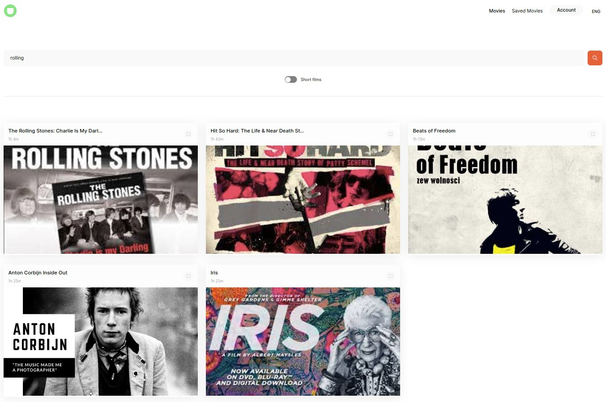
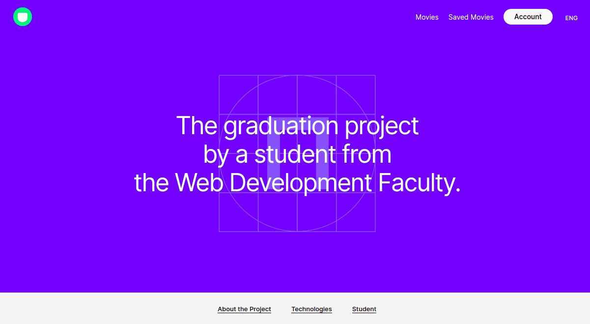
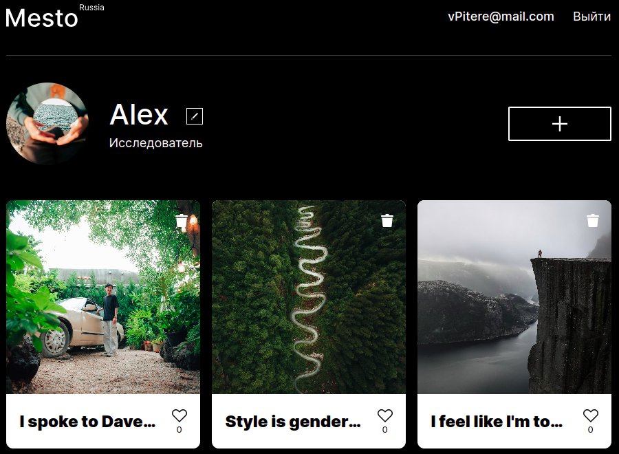

<h1>
  👋 Hello! I'm <a href="https://tarantino.nomoredomains.work/en/">Alex</a>
</h1>

  

<h2>📌 About Me</h2>

<ul>
  <li> 👨‍💻 Frontend Developer.</li>
  <li> 🎓 Graduated from the Faculty of CTU at ITMO.</li>
  <li> 🛠️ Former engineer and worked in sales.</li>
  <li> 🔭 Recently ventured into design and coding.</li>
  <li> 🎧 Love listening to music, attending concerts and playing volleyball.</li>

<h2>🚀 Technologies Mastered</h2>

During the web development course, I mastered the following technologies:

  
  
  
  
  
  
  

<h2>🎨 My Projects</h2>

<ul style="list-style-type: none">
  <li style="margin-bottom: 20px">
  <h3>Improved Graduation Project</h3>
        
    

      This repository is an enhanced version of my original diploma project's
      frontend. Building on the core functionality of a service where users can
      search for films and save their favorites, this new iteration introduces
      PWA (Progressive Web App) capabilities and a language switcher feature.
    

    <a href="https://github.com/yacax/pwa-movies-explorer-frontend.git"
      >Repository</a
    >
  </li>
   
  <li style="margin-bottom: 20px">
  <h3>Graduation Project</h3>
        
    

      The objective of this project is to build a service that allows users to
      search for films and save their favourite ones in a personal space. The
      user enters keywords into the search bar and clicks on the "Search"
      button. Then, two actions are performed: A request is sent to our movie
      data service to retrieve and save data. Films corresponding to the
      selected genre are found and displayed as cards. When a user saves a film,
      it appears in a special section of the website.
    

    <a href="https://github.com/yacax/movies-explorer-frontend.git"
      >Repository</a
    >
     
  </li>

  <li>
  <h3>Project MESTO</h3>
        
    

      The interactive web page where users can add photos, delete them, and give
      likes.
    

    <a href="https://github.com/yacax/react-mesto-api-full-gha.git"
      >Repository</a
    >
  </li>
</ul>
 
<h2>🔗 Explore My Projects</h2>

  

  Dive into my
  <a href="https://github.com/yacax?tab=repositories">GitHub profile</a> to see
  all my repositories. From experimental projects to the production-ready
  applications, you'll find a wide variety of codes and solutions there.

<h2>📈 GitHub Stats</h2>

